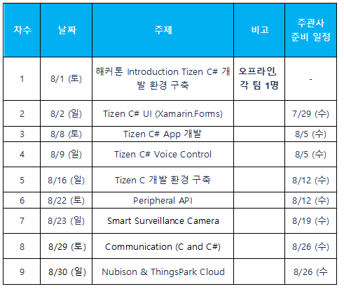
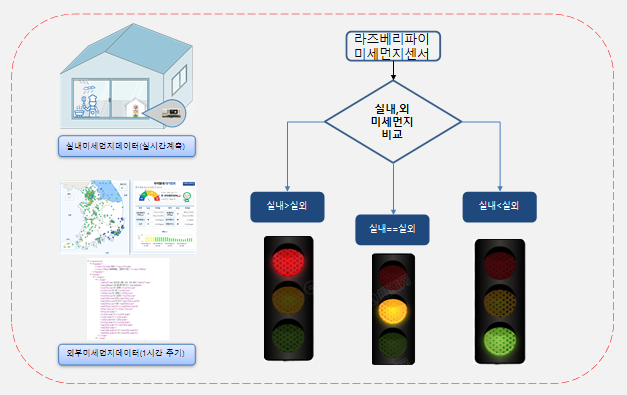
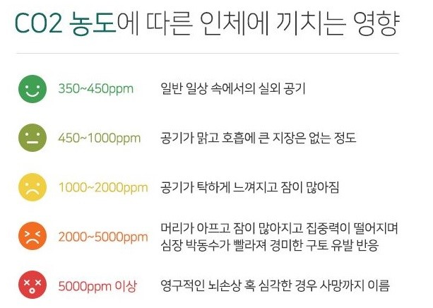
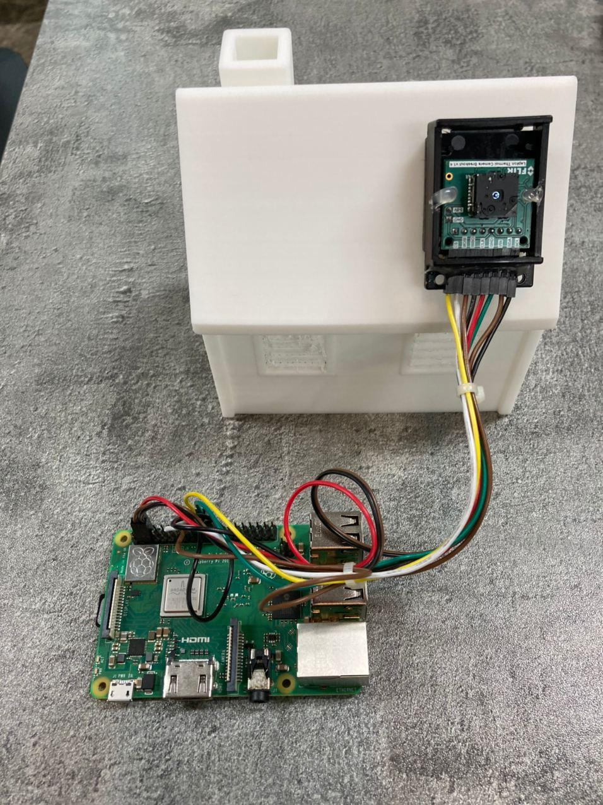
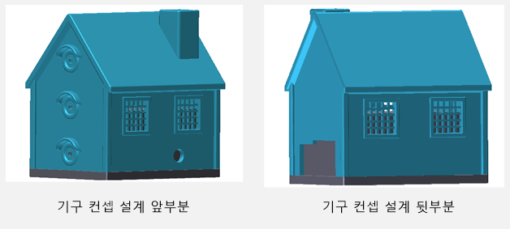
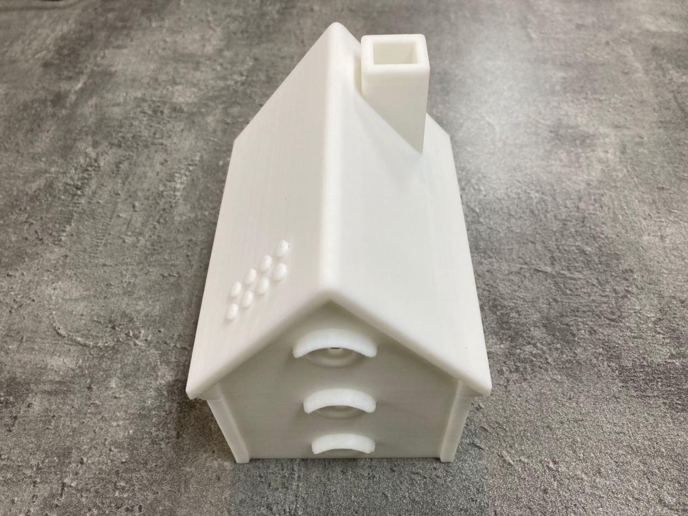
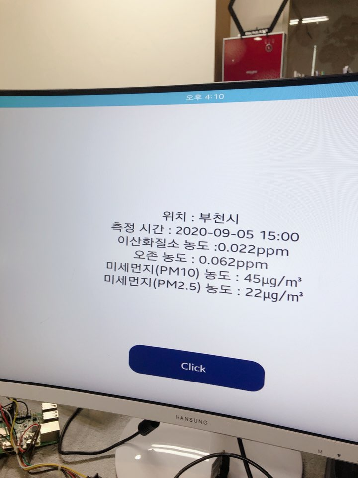

# 실력이 부족한 관계로 하드웨어 해커톤 참여 포기 의사를 밝힘.

# 2020 서울 하드웨어 해커톤 탑메이커 프로젝트

  - 팀명 : Three-Idiots 
  
## 미션수행
  [Mission.md](Mission.md)

## 참고 사이트

[TizenSchool](https://tizenschool.org/home)

[CraftRoom](https://craftroom.tizen.org/)

## 일정
  </img>

## 팀원
  - 김한결, 박수환, 민지선
  
   </img>
   
## 아이디어

  - Safe House
  
    - 개요 : 홈퍼니싱 시장 성장, 전파성 바이러스에 확산과 더불어, 실내에 머무는 시간이 급격히 증가하여 실내에 대한 환경을 개선할 필요성이 있음.
    
    - 개발 목적 : 라즈베리파이와 환경센서를 이용하여, 실내환경 정보를 모니터링 및 제어, 실내 환경을 개선
    
    - 서비스 
      1. 환기 적정 시점 알림 서비스
         - 실내 미세먼지량과 외부미세먼지량을 비교하여 환기에 대한 적정시점을 시각적으로 알려줌.
         - 실내 미세먼지 측정 : 라즈베리파이와 Hpma115s0 미세먼지 측정 센서를 이용(UART통신)
         - 외부 미세먼지 측정 : 공공 데이터 포털 오픈 API (한국환경공단_대기오염정보) 를 이용하여 거주지역 외부 미세먼지 데이터를 가져옴.
         - 실내 && 외부 미세먼지를 비교하여, 환기 적정 시점을 시각적으로 알려줌
         
          </img>
          
      2. 실내 쾌적 환경 서비스
      
          - CO2 센서 (T-100A)를 사용하여 이산화탄소 수치에 따라서 휴식 시점을 시각적으로 알려줌.
          
            </img>
          
          - 온/습도 센서 (DHT11) 를 이용하여, 사용자가 설정한 습도보다 낮을시 자동으로 가습기를 제어(PP-A465 110KHz 5V)
          
      3. 방법 서비스
      
          - 텔레그램으로 /on 명령을 보내면 방범시스템 가동
          
          - 인체감지 센서를 이용하여 방법 시스템이 가동 되었을시 인체감지가 되면 카메라 사진을 telegram 으로 전송
          
          
    - 시스템 구성도
  
        </img>
        
    - 유튜브 영상
      
      [라즈베리파이 미세먼지 신호등](https://youtu.be/OcYlDBu4dLM)
      
     
      
  
  - Safe Office
  
    - 개요 : 전세계적으로 전염성 바이러스 출현
    
    - 개발 목적 : 다중이용시설에 방문자 출입시 체온을 측정에 한계, 
    
        - 출입명부를 수기로 작성
        
        - 온도 체크 못하고 지난친 사람 존재
        
        - 열화상 카메라 시스템은 고가 장비
  
    - 열화상 센서를 이용하여 사용자 체온을 방문자 체온을 측정하며, 이상 상황 발생시 LED 조명을 통해 시각적으로 알려줌
    
    - 추후 계획 방문자에 대한 위치정보 모니터링 및 QR 코드 연계
    
    - 시스템 구성
    
      </img>
    
    - 유튜브 영상
      
      [라즈베리파이 열화상 카메라 체온 측정 및 이상상황 LED 알림장치](https://youtu.be/Ekh_GuLjOIA)
  
## 기구 설계

  - 1차 컨셉 : Safe House
  
      </img>
    
  - 2차 컨셉 : 기존 + Safe Office
  
    : G 캠프 기구설계 팀에 컨설팅 받음 8/31
    
    : 열화상 카메라 케이스 부착 변경
    
    : 굴둑 가습기 구멍 구분 변경
    
    : 기타 
  
      </img>

## 파일 리스트

  - 라즈베리파이 
  
    ./app/DustSensor (HPMAS0 미세먼지센서 python 코드)
    
    ./app/TOD (열화상 라즈베리파이 C++코드)
    
    ./app/co2 (이산화탄소 센서 python 코드)
    
    ./app/zigbee/ (지그비 무선통신 임베디드 소스코드 nesC)
    
  - Tizen
  
    ./tizen-project/TizenPrj -> TizenPrj -> TizenPrj -> Views 미세먼지 공공 API 소스코드
    
    ./app/camera Tizen camera 활용 코드

## Tizen 구현 화면

   </img>
  
   
### 1Days 

[타이젠 소개](http://tizenschool.org/tutorial/150)

[타이젠 C# 개발환경구축](http://tizenschool.org/tutorial/194)

[강의영상](https://www.youtube.com/watch?v=AobfrqCJiS0)

### 2Days

[Xamarin.Forms UI 영상](http://tizenschool.org/tutorial/206)

### 3Days
[Tizen C# App 개발 <http통신연계> 강의자료](http://tizenschool.org/tutorial/197)

[Tizen C# App 개발 <http통신연계> 강의영상](https://www.youtube.com/watch?v=8P3vHggZEd8)

### 4Days
[C# Voice Control 강의자료](http://tizenschool.org/tutorial/203)

[C# Voice Control 강의영상](https://www.youtube.com/watch?v=AbmMxXsw6Ng)

### 5Days
[C 개발 환경구축 강의자료](http://tizenschool.org/tutorial/157)

[C 개발 환경구축 강의영상](https://www.youtube.com/watch?v=OytyspYBilw)

### 6Days
[Pheripheral API <GPIO> 강의자료](http://tizenschool.org/tutorial/154)
  
[Pheripheral API <I2C> 강의자료](http://tizenschool.org/tutorial/153)
  
[Pheripheral API <SPI> 강의자료](http://tizenschool.org/tutorial/152)
  
[Pheripheral API 강의영상](https://www.youtube.com/watch?v=yKTqiPIzAo4)

### 7Days
[Smart Surveillance Camera 강의자료](http://tizenschool.org/tutorial/160)

[Smart Surveillance Camera 강의영상](https://www.youtube.com/watch?v=C_Ab0oTh7XM0)

### 8Days
[How to use the C API in the C# App 강의자료](http://tizenschool.org/tutorial/208)

[How to communicate with applications using Message-Port 강의자료](http://tizenschool.org/tutorial/200)

[How to communicate with applications using TIDL 강의자료](http://tizenschool.org/tutorial/213)

### 9Days

[Nubison Cloud]

[ThingsPark Cloud]

  

